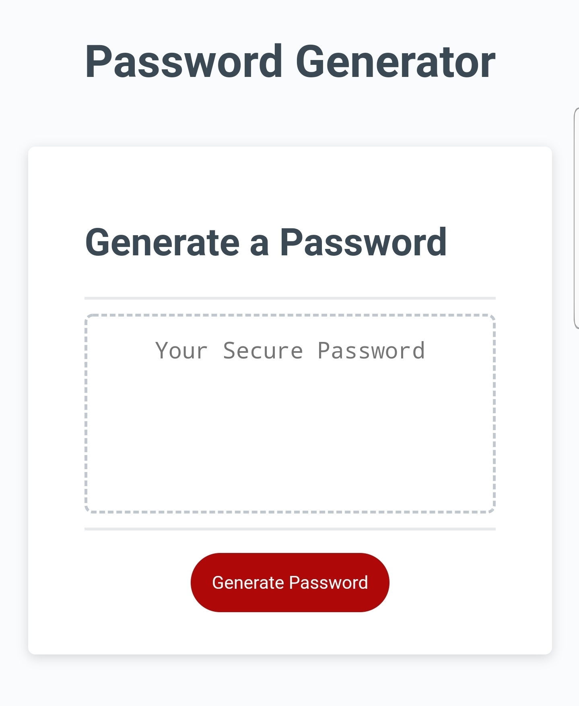

# Password-Generator

Explore the [project-page](https://github.com/Mgithub89/Password-Generator.git)

View the [deployed-app](https://mgithub89.github.io/Password-Generator/)

## Table of contents
   * [About The project](#About-The-Project)
   * [Acceptance Criteria](#Acceptance-Criteria)
   * [ScreenShot Image](#ScreenShot-Image)
   * [Built With](#Built-With)
   * [Contact](#Contact)

## About The Project.
 The Objective of this project is to create an app that generates a random password that provieds greater security based on a user-selected criteria.
 When the user clicked generate password button the user presented with a series of prompts and confirm for a password criteria such as password length(8-128) and a character type(upper-case, lower-case,number and special character) to include in the password. If the user failed to choose a password length between 8-128 character the app alert the user length must be 8-128 charater and if the user failed to choose at least one special character the user gets an alert to include at least one special character.
 After all prompts answered and the user input validated the app generates the password that matches the selected criteria and the password written to the page . 

 ### Acceptance Criteria
GIVEN I need a new, secure password.
WHEN I click the button to generate a password.
THEN I am presented with a series of prompts for password criteria.
WHEN prompted for password criteria.
THEN I select which criteria to include in the password
WHEN prompted for the length of the password
THEN I choose a length of at least 8 characters and no more than 128 characters
WHEN prompted for character types to include in the password
THEN I choose lowercase, uppercase, numeric, and/or special characters
WHEN I answer each prompt
THEN my input should be validated and at least one character type should be selected
WHEN all prompts are answered
THEN a password is generated that matches the selected criteria
WHEN the password is generated
THEN the password is either displayed in an alert or written to the page

### ScreenShot Image

 ### Built with
      * JavaScript
      * HTML
      * CSS

### Contact
 Metages Worku - [metages09@gmail.com](mailto:metages09@gmail.com)
      
